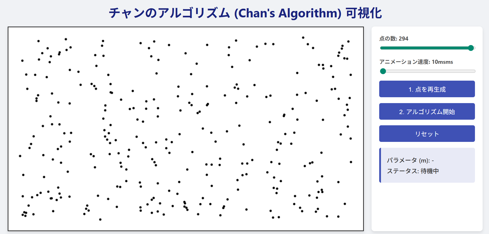

# チャンのアルゴリズム可視化ツール

## 概要

本プロジェクトは、計算幾何学における凸包を求めるアルゴリズムの一つである「チャンのアルゴリズム (Chan's Algorithm)」の動作を視覚的に学習するためのWebアプリケーションである。アルゴリズムの各ステップをアニメーションで表示することで、その複雑な挙動の直感的な理解を支援することを目的とする。

## スクリーンショット

## 機能一覧

  * **アルゴリズムのステップ可視化**: チャンのアルゴリズムの以下の主要なステップを順を追って表示する。
    1.  点群のグループ分割
    2.  各グループの「ミニ凸包」の計算
    3.  全体の凸包の頂点探索（接線候補の表示と選択）
    4.  パラメータ`m`が不適切な場合の再試行プロセス
  * **動的なパラメータ調整**:
      * **点の数**: スライダー操作で点群の数をリアルタイムに変更できる。
      * **アニメーション速度**: アルゴリズムの実行速度を調整し、詳細な観察を可能にする。
  * **対話的な操作**:
      * 点群のランダムな再生成。
      * アルゴリズムの開始・リセット。

## アルゴリズムについて

チャンのアルゴリズムは、与えられた $n$ 個の点群に対する凸包を $O(n \\log h)$ の計算時間で求める出力依存型アルゴリズムである（$h$ は凸包の頂点数）。

このアルゴリズムは、グラハムスキャン ($O(n \\log n)$) とジャービスの行進 ($O(nh)$) という、他の2つの有名な凸包アルゴリズムの長所を組み合わせたハイブリッドな手法である。

1.  まず点群を $m$ 個の小さなグループに分割し、各グループで高速なグラハムスキャンを用いて「ミニ凸包」を計算する ($O(n \\log m)$)。
2.  次に、これらのミニ凸包をヒントとして利用し、ジャービスの行進のように全体の凸包の頂点を一つずつ効率的に探索していく。
3.  最適なグループ数 $m$ は未知であるため、$m$ の値を $2^{2^t}$ ($t=1, 2, ...$) のように指数関数的に増加させながら、凸包が見つかるまで試行を繰り返す。

この巧妙な試行錯誤のプロセスにより、最終的に $O(n \\log h)$ という優れた計算量を達成する。

## 使用技術

  * **HTML**: アプリケーションの基本的な構造を定義。
  * **CSS**: Flexboxを用いたレイアウト設計と、視覚的なデザイン全般を担当。
  * **JavaScript (ES6+)**:
      * チャンのアルゴリズム本体の実装。
      * HTML Canvas APIを用いた点、線、多角形の描画処理。
      * DOM操作によるUIの対話的な制御。
      * async/awaitを用いたアニメーションの非同期制御。

## 操作説明

  * **点の数**: スライダーを動かして、生成される点の数を指定する。
  * **アニメーション速度**: スライダーを動かして、可視化のアニメーション速度を調整する。値が小さいほど速く動作する。
  * **「1. 点を再生成」ボタン**: 現在の点群を破棄し、新しいランダムな点群をキャンバス上に生成する。
  * **「2. アルゴリズム開始」ボタン**: キャンバス上の点群に対して、チャンのアルゴリズムを実行する。
  * **「リセット」ボタン**: 実行中のアルゴリズムを中断し、初期状態に戻す。